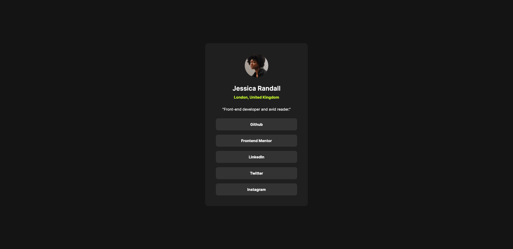

# Frontend Mentor - Social links profile solution

This is a solution to the [Social links profile challenge on Frontend Mentor](https://www.frontendmentor.io/challenges/social-links-profile-UG32l9m6dQ). Frontend Mentor challenges help you improve your coding skills by building realistic projects. 

## Table of contents

- [Overview](#overview)
  - [The challenge](#the-challenge)
  - [Screenshot](#screenshot)
  - [Links](#links)
- [My process](#my-process)
  - [Built with](#built-with)
  - [What I did differently](#what-i-did-differently)
  - [Useful resources](#useful-resources)
- [Author](#author)

**Note: Delete this note and update the table of contents based on what sections you keep.**

## Overview

### The challenge

Users should be able to:

- See hover and focus states for all interactive elements on the page

### Screenshot

### Links

- Solution URL: [github.com/jyeharry/social-links-profile](https://github.com/jyeharry/social-links-profile)
- Live Site URL: [jyeharry.github.io/social-links-profile/](https://jyeharry.github.io/social-links-profile/)

## My process

### Built with

- Semantic HTML5 markup
- CSS custom properties
- Flexbox
- [Utopia](https://utopia.fyi/) for fluid responsiveness

### What I did differently

The design for this challenge contained three different sizes. After learning about the design tool, [Utopia](https://utopia.fyi/), and how easy it makes building truly responsive designs, I decided not to use media queries in my solution therefore foregoing the tablet design. The solution still adheres to the design on tablets, it's just not pixel perfect but this is a small price to pay for less boilerplate code.

### Useful resources

- [Utopia](https://utopia.fyi/) for fluid responsiveness, saves having to use media queries.

## Author

- Website - [jyeharry.github.io/](https://jyeharry.github.io/)
- Frontend Mentor - [@jyeharry](https://www.frontendmentor.io/profile/jyeharry)
- Github - [@jyeharry](https://github.com/jyeharry)

